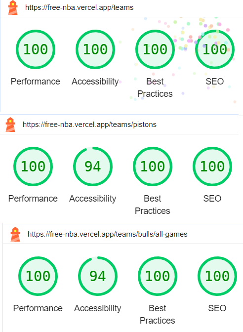

## Running the project

Install all necessary dependencies with **npm install** and run the project with **npm run dev**. There's a chance you might need to update your Node version before.

## Deployed version

You can see the deployed version at https://free-nba.vercel.app/ for convenience.

## Google Lighthouse scores for the project

The project achieved virtually perfect scores in all audits in Google Lighthouse. The 94 Accessibility score is due to a small detail: the low contrast between the dark background and the red font in the losing team score. Easily fixable and adjustable.

To run these test, just open the "Inspect" window on Google Chrome, then go to the the Lighthouse tab and choose "Analyze page load".

## Responsiveness

All pages are fully responsive for mobile screen sizes.
